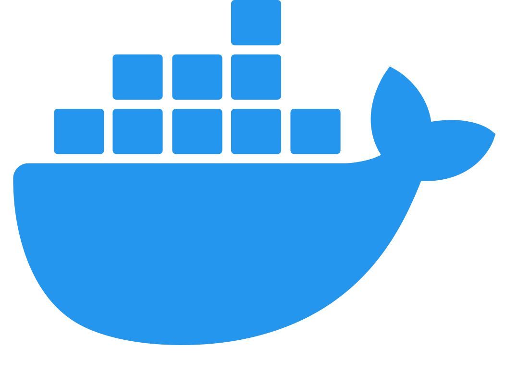

<p align="center">          </p>

# MERN stack app using Next.js

MERN app using Next.js and deployed on Docker.

## [Demo](https://node-next.herokuapp.com/) 🥳🎉

## Tech stack

- Frontend: React (Next.js)
- Backend: Express.js
- Database: MongoDB
- Platform: Node.js
- Deployment: Docker

## Directory structure

```
.
├── Dockerfile
├── README.md
├── __tests__
├── api
├── components
├── docker-compose.yml
├── heroku.yml
├── jest.config.js
├── jest.setup.js
├── less
├── next.config.js
├── package.json
├── pages
├── public
├── server.js
├── services
├── tree.txt
└── yarn.lock
```

## Steps to run

### Clone the repo

```bash
git clone git@github.com:afzalsayed96/next-app.git
cd next-app
```

### Start server

Go to project directory and run

```bash
docker-compose up --build web
```

App will start running at `localhost:3000`

### Running tests

```
docker-compose build test
docker-compose run test
```

## Starter boilerplate

- Create Next App
- https://github.com/mui-org/material-ui/tree/master/examples/nextjs

## References

- https://codingthesmartway.com/the-mern-stack-tutorial-building-a-react-crud-application-from-start-to-finish-part-2/

## Assets

- https://undraw.co
